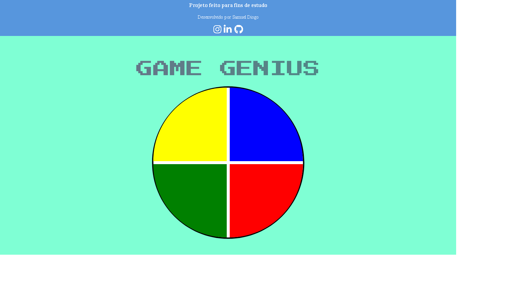

<h1 align="center">
PROJETO DIO - GAME GENIUS
</h1>

- Nesse projeto, o desafio será criar um jogo Gênesis utilizando apenas HTML, CSS e Javascript de forma introdutória, sendo o principal conceito, CSS Grid, manipulação de Array e Arrow Functions.

[Sammynauta](https://github.com/Sammynauta)

# Alterações
- DESIGN: adição de bordas e tiTulo pro game.

- CODIGO: no original quando uma cor era selecionada duas 2x nao tinha como identicar, pois ela já estava selecionada, por isso ela mantinha a cor ativada sem dar chance para o usuario saber se ela foi duas ou mais vezes ativada.

#### NA ALTERAÇAO QUE FIZ coloquei um EFEITO ANIMATION PRA COR QUE FOI SELECIONADA.

## Resources

- [x] HTML, CSS e JAVASCRIPT.

## SLIDES

